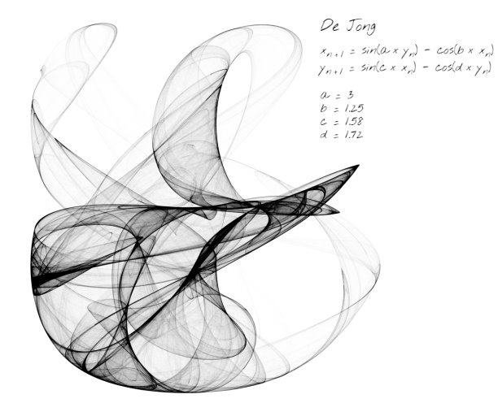

# strange-attractors-webgl

## Description
Strange attractors are complex mathematical figures representing the path traced by a point iteratively moved following strict rules. Strange attractors often exhibit beautiful fractal patterns. The figures drawn in this experiment are the superposition of many different trajectories from random starting points.

This project supports various attractor types, and for each of them you can change the parameters and watch unique patterns appear.

See it live [here](https://piellardj.github.io/strange-attractors-webgl/?page%3Acheckbox%3Aformula-checkbox-id=true&page%3Acanvas%3Afullscreen=true&page%3Acanvas%3Asidepane=true).

